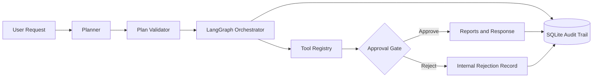

# AI Agent Orchestration System

An offline-first Customer Operations AI Agent that turns a business request into a validated, tool-driven, human-approved workflow with a durable audit trail.

## Project Overview

This portfolio project demonstrates production-minded agent architecture without pretending to perform real business actions. A single orchestrating agent plans up to eight steps, validates dependencies and tool inputs, runs local business tools through LangGraph, pauses before sensitive finalization, and persists the complete explainable trace in SQLite.


## Features

- Complete offline operation with deterministic planning and fictional seeded data
- LangGraph-controlled step execution and resumable approval gate
- Pydantic plan and input validation with dependency and risk controls
- Nine registered tools; arbitrary tool execution is impossible
- Decimal-safe refund calculations and deterministic business rules
- SQLite task, step, approval, and event history
- Dark Streamlit workspace, execution trace, downloads, and task explorer
- Optional OpenAI, Anthropic, Gemini, and local Ollama planning
- Safe failure handling with no stored API keys or hidden chain-of-thought

## How the Agent Works

The agent extracts explicit intents and identifiers, emits one structured plan schema, validates it, and executes only registry tools. Dependent inputs use public result references such as `$policy_checker.amount_paid`. A provider model may propose a plan, but it never calls a tool and its output receives exactly the same validation as an offline plan.

## Workflow Architecture



LangGraph is the workflow engine: it plans, validates, selects one ready step, executes it, records results, enters `waiting_for_approval`, and terminates that run. A later UI rerun loads the state from SQLite, records the decision, and invokes the graph from the preserved plan.

## Available Tools

| Tool | Purpose | Risk |
|---|---|---|
| `customer_lookup` | Retrieve a fictional customer | Low |
| `case_lookup` | Retrieve and cross-check a case | Low |
| `policy_checker` | Apply deterministic refund rules | Medium |
| `refund_calculator` | Calculate a recommendation with `Decimal` | Medium |
| `priority_classifier` | Explainably classify Low/Medium/High | Low |
| `sla_checker` | Compare elapsed time with seeded SLA rules | Low |
| `generate_report` | Write Markdown and plain-text internal reports | Approval required |
| `generate_customer_response` | Draft, but never send, a response | Approval required |
| `task_history_search` | Search prior persisted tasks | Low |

## Planning Modes

**Offline / Deterministic** is the default. It uses explicit intent patterns, `CASE-###` and `CUST-###` extraction, duplicate removal, and fixed dependency ordering.

**LLM** supports OpenAI, Anthropic, Gemini, and Ollama. The provider receives tool descriptions, the Pydantic JSON schema, step limit, and approval rules. Invalid output fails safely and the user can return to offline mode.

## Application Modes

Set `APP_MODE` to `demo` or `local`. When the variable is missing or invalid, the application safely defaults to `local`.

### Demo Mode

- Designed for hosted Streamlit deployment
- Uses only fictional seeded customer, order, and case data
- Uses deterministic planning and requires no API key
- Demonstrates LangGraph orchestration, registered tools, human approval, reports, customer responses, and Task History
- Keeps free-text Customer Operations tasks and the built-in workflow examples available

### Full Local Mode

- Enables deterministic and optional LLM planning
- Supports OpenAI, Anthropic, Gemini, and Ollama
- Includes session-only API-key controls when an external provider is selected
- Intended for local development and full experimentation

## Human-in-the-Loop

Refund calculations are recommendations. Before an internal report or customer draft is finalized, execution stops in a persistent waiting state and shows the customer, case, policy result, amount, priority, SLA, and completed tools. Approval resumes generation. Rejection generates only an internal rejection record and skips the customer response; neither path transfers money.

## Memory and Task History

SQLite stores operational demo records plus `tasks`, `task_steps`, `approvals`, and `tool_events`. The Task History view reopens original requests, plans, inputs, outputs, timing, decisions, safe errors, and final artifacts. Queries are parameterized and initialization is idempotent.

## Offline and LLM Modes

Offline mode needs no account, internet connection, or API key after installation. Optional credentials are read from environment variables or a password-style session field. Session keys are omitted from logs, workflow state persistence, and the database. `.streamlit/secrets.toml` may also expose the same environment-style values through your own deployment setup; never commit that file.

## Technologies Used

Python 3.11+, Streamlit, LangGraph, SQLite, Pydantic v2, Pytest, and standard Python logging. Optional provider SDKs are loaded only when selected.

## Project Structure

```text
app.py                    Streamlit entry point
src/agent/                state, schemas, validator, LangGraph, orchestrator
src/planners/             deterministic and optional LLM planners
src/tools/                centralized registry and nine tools
src/execution/            input resolution and approval helpers
src/memory/               SQLite schema, repositories, deterministic seed data
src/providers/            lazy provider adapters
src/reporting/            controlled report and response builders
src/ui/                   workspace, history, components, styling
tests/                    planner, validator, tool, and workflow tests
generated_reports/        runtime Markdown and text artifacts
```

## Installation

```bash
python -m venv .venv
# Windows
.venv\Scripts\activate
# macOS/Linux
source .venv/bin/activate
pip install -r requirements.txt
```

With `uv`:

```bash
uv sync --extra test
```

Copy `.env.example` to `.env` for local configuration. The `.env` file is ignored by Git and may also contain your optional local provider credentials; never commit real API keys. Ollama uses its local HTTP endpoint and does not require a cloud key.

## Running the Application

Create a `.env` file in the project root for Full Local Mode:

```dotenv
APP_MODE=local
```

For Demo Mode, use:

```dotenv
APP_MODE=demo
```

Then start the application on Windows, macOS, or Linux:

```bash
streamlit run app.py
```

An existing runtime environment variable takes precedence over `.env`, which keeps hosted configuration working. If neither source defines `APP_MODE`, the app defaults to Full Local Mode. The first launch creates `data/agent_operations.db` and seeds it idempotently.

### Streamlit Community Cloud

Deploy `app.py` as the entry point and set the root-level app secret `APP_MODE="demo"` in the Streamlit Community Cloud secrets configuration. Root-level Streamlit secrets are exposed as environment variables. No provider key, Ollama service, Redis, PostgreSQL, or other external service is required. The deployment uses the local SQLite database and file-based report directory supplied by the app instance; their contents may reset when the hosted instance is recycled.

## Example Workflows

- `Review CASE-220, check eligibility, calculate the refund, and prepare a customer response.` — eligible approval branch
- `Determine the priority and SLA status of CASE-225.` — high-priority, breached-SLA branch
- `Review CASE-223 refund eligibility and calculate the refund amount.` — manual-review branch
- `Review CASE-224 refund eligibility and prepare a response.` — already-refunded, ineligible branch
- `Check customer CUST-104 and summarize all open cases.`
- `Show the most recent approved refund case.`

Other useful demo IDs include `CUST-101`, `CUST-104`, `CASE-220`, `CASE-225`, and missing-information case `CASE-229`.

## Testing

```bash
pytest
```

Tests cover intent selection, ordering, deduplication, plan constraints, tool safety, all refund policy branches, decimal money, priority, SLA, unknown IDs, persistence, history, approval, rejection, recovery, and the complete offline workflow.

## Limitations

- V1 uses one bounded orchestrating agent and synchronous local execution.
- Text classification is deliberately rule-based in offline mode.
- Seeded timestamps make demonstrations predictable rather than real-time.
- Provider model names and APIs can evolve; provider failures are surfaced safely.
- Customer drafts are downloadable, but never sent.

## Future Improvements

PostgreSQL persistence, Redis coordination, multi-agent architecture, real CRM integrations, advanced semantic memory, role-based access control (RBAC), background workers, distributed execution, Docker deployment, monitoring and observability, real payment integrations with strong controls, and production deployment infrastructure.

## Disclaimer

All customers, cases, and orders are fictional. This project is for educational and portfolio purposes. It does not execute real refunds, financial transactions, messages, or customer actions. Every recommendation requires human review, and the application is not connected to a real CRM or payment system.

## License

Released under the [MIT License](LICENSE).
