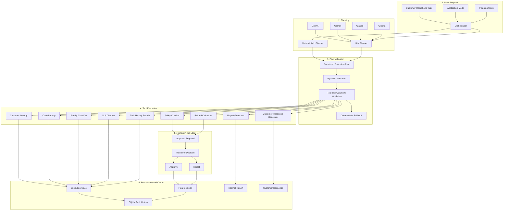

# AI Agent Orchestration System

A multi-provider AI Agent orchestration application that interprets Customer Operations tasks, selects and executes specialized tools, maintains task history, supports human-in-the-loop approval, and provides deterministic fallback when LLM planning is unavailable or invalid.


---

## Overview

AI Agent Orchestration System is a Customer Operations AI Agent designed to demonstrate how an AI system can plan tasks, select tools, execute multi-step workflows, maintain persistent task history, and pause for human approval before sensitive operations continue.

Instead of behaving as a general-purpose chatbot, the application receives an operational task and converts it into a structured execution workflow.

Depending on the request, the system can:

- Look up customer information
- Review customer cases
- Evaluate refund eligibility
- Calculate refund recommendations
- Determine priority and SLA status
- Search previous task history
- Generate internal reports
- Draft customer responses
- Pause workflows for human approval
- Resume approved or rejected workflows safely

The project supports both deterministic planning and optional LLM-based planning.

When an LLM cannot produce a valid execution plan, the application can fall back to the deterministic planner for supported workflows.

---

## Key Features

- Convert natural-language operational tasks into structured workflows
- Support deterministic and LLM-based planning
- Support OpenAI, Gemini, Claude, and Ollama
- Run completely without an external API key using deterministic planning
- Support local LLM planning through Ollama
- Validate LLM-generated execution plans before execution
- Fall back safely to deterministic planning when appropriate
- Route tasks to specialized tools
- Execute multi-step workflows
- Maintain workflow state across execution steps
- Pause sensitive workflows for human approval
- Resume execution after approval or rejection
- Maintain persistent task history
- Search previous task records
- Generate internal reports
- Draft customer responses
- Provide execution traces for workflow transparency
- Reject unsupported write actions safely
- Handle unknown customer and case IDs safely
- Separate safe Public Demo behavior from Local Full Mode
- Use fictional customer and case data for demonstrations
- Include automated tests using Pytest
- Provide an interactive Streamlit interface

---

## Demo Workflow

1. Enter a Customer Operations task.
2. Send the request to the selected planner.
3. Convert the request into a structured execution plan.
4. Validate the proposed plan.
5. Route each step to the required tool.
6. Execute tools in the required order.
7. Store intermediate workflow state.
8. Pause if human approval is required.
9. Resume the workflow after approval or rejection.
10. Generate the final result, report, or customer response.
11. Persist the task and execution history.

Example workflow:

```text
User Task
    |
    v
Planner
    |
    +--------------------------+
    |                          |
    v                          v
Deterministic Planner      LLM Planner
                               |
                               v
                        Plan Validation
                               |
                               v
                    Deterministic Fallback
                         when required
                               |
                               v
                        Tool Selection
                               |
                               v
                      Workflow Execution
                               |
                  +------------+------------+
                  |                         |
                  v                         v
            Normal Step              Sensitive Step
                  |                         |
                  |                         v
                  |                  Human Approval
                  |                         |
                  |                    Approve/Reject
                  |                         |
                  +------------+------------+
                               |
                               v
                        Final Resolution
                               |
                  +------------+------------+
                  |                         |
                  v                         v
           Internal Report          Customer Response
                              
                               |
                               v
                         Task History
```

---

## System Architecture



---

## Agent Tools

The agent uses specialized backend tools rather than allowing the language model to perform operations directly.

### Customer Lookup

Retrieves fictional customer information using a customer ID.

### Case Lookup

Retrieves information about a specific customer case.

### Policy Checker

Evaluates a case against the configured refund policy and determines whether it is:

- Eligible
- Not eligible
- Requires manual review

### Refund Calculator

Calculates a refund recommendation using the case and policy information.

### Priority Classifier

Determines the operational priority of a case.

### SLA Checker

Evaluates the case against its service-level target and identifies whether the SLA has been breached.

### Task History Search

Searches previous agent execution records, including previously approved refund workflows.

### Internal Report Generator

Creates an internal report from the resolved workflow state.

### Customer Response Generator

Generates a customer-facing draft response using the available case and workflow information.

---

## Human-in-the-Loop Approval

Sensitive recommendations can pause the workflow before completion.

For example, a refund workflow can:

1. Retrieve the customer and case.
2. Evaluate refund eligibility.
3. Calculate a recommended refund.
4. Pause before finalizing the workflow.
5. Display the recommendation to a human reviewer.
6. Allow the reviewer to approve or reject it.
7. Resume execution from the existing workflow state.

The reviewer can also provide a note that becomes part of the audit trail.

### Approved workflow

When approved, the workflow can continue to:

- Record the approval decision
- Generate an internal report
- Draft a customer response when requested
- Mark the task as completed

### Rejected workflow

When rejected:

- The recommendation remains rejected
- No refund is represented as processed
- An internal record can still be generated
- A customer response is not produced unless appropriate for the workflow

The application demonstrates approval orchestration only.

It does not transfer real funds.

---

## Planner Architecture

The application supports two planning approaches.

### Deterministic Planner

The deterministic planner recognizes supported Customer Operations requests and creates predefined, validated workflows.

Advantages:

- No API key required
- Predictable behavior
- Reproducible demonstrations
- Safe Public Demo operation
- Reliable fallback path

### LLM Planner

The LLM planner allows supported providers to interpret more flexible natural-language tasks and propose structured execution plans.

LLM-generated plans are not executed blindly.

Before execution, the system validates the proposed plan and its tool calls.

If LLM planning cannot produce a valid plan for a request that the deterministic planner supports, the system can use deterministic fallback.

This keeps the LLM responsible for planning while the backend remains responsible for validation and execution.

---

## Planning Fallback

LLM output can occasionally be malformed, incomplete, or incompatible with the available tool schema.

The application therefore includes a fallback mechanism.

```text
User Request
     |
     v
LLM Planner
     |
     v
Valid Plan?
   /     \
 Yes      No
 |         |
 v         v
Execute   Deterministic Planner
             |
             v
         Valid Plan?
          /     \
        Yes      No
        |         |
        v         v
     Execute   Safe Failure
```

When fallback occurs, the interface explicitly displays:

```text
LLM → Deterministic fallback
```

This makes planner behavior visible rather than silently hiding failures.

---

## Application Modes

The project separates the hosted portfolio demonstration from full local experimentation.

| Mode | External API Keys | Planning | Intended Use |
|---|---|---|---|
| Demo | Not required | Deterministic | Hosted portfolio demonstration |
| Local Full | Optional | Deterministic or LLM | Full local experimentation |

---

## Public Demo Mode

Demo Mode is designed for safe hosted deployment.

In this mode:

- No external provider is required
- Visitors are not asked to provide API keys
- Planning is deterministic
- Fictional customer and case records are used
- Human approval workflows remain available
- Task execution remains fully functional for supported workflows
- Unsupported actions are blocked
- Unknown IDs fail safely
- Execution traces remain available
- Task history remains available
- Internal reports and customer response drafts can be generated when supported

The interface includes a Demo Data Guide showing the fictional IDs available for experimentation.

The current demo dataset contains:

```text
8 customers
10 cases
```

Customer IDs:

```text
CUST-101
CUST-102
CUST-103
CUST-104
CUST-105
CUST-106
CUST-107
CUST-108
```

Case IDs:

```text
CASE-220
CASE-221
CASE-222
CASE-223
CASE-224
CASE-225
CASE-226
CASE-227
CASE-228
CASE-229
```

---

## Local Full Mode

Local Full Mode enables deterministic planning and optional LLM planning.

Supported providers:

- OpenAI
- Google Gemini
- Anthropic Claude
- Ollama

The user can switch between:

```text
Offline / Deterministic
LLM
```

Cloud-provider API keys can be supplied locally.

Ollama uses a locally running Ollama server and does not require an API key.

Local Full Mode allows users to experiment with more flexible task wording while preserving the same backend validation, tool execution, approval, and task-history architecture.

---

## Demo Data

The project includes fictional Customer Operations records for safe experimentation.

The demo dataset includes:

```text
8 customers
10 cases
```

Example case information includes:

- Customer ID
- Case ID
- Case type
- Case status
- Issue description
- Order ID
- Purchase amount
- Purchase date
- Purchase age
- Usage percentage
- Priority information
- SLA information

Example workflows are designed to demonstrate different operational scenarios, including:

- Eligible refund cases
- Non-eligible refund cases
- Manual-review cases
- SLA breaches
- Customers with multiple open cases
- Task-history retrieval
- Human approval

No real customer or business information is included.

---

## Supported Tasks

The current version can handle supported Customer Operations tasks such as:

```text
Review a customer case
Check refund eligibility
Calculate a refund recommendation
Determine priority
Check SLA status
Summarize a customer's open cases
Search previous task history
Find previous approved refund cases
Generate an internal report
Draft a customer response
```

The agent can also combine multiple supported operations into one workflow.

For example:

```text
Review CASE-220, check eligibility, calculate the refund, and prepare a customer response.
```

---

## Unsupported Actions

The V1 agent intentionally prevents operations that would modify external systems or perform real-world transactions.

Examples include:

```text
Sending emails or SMS
Executing real refunds or payments
Deleting customer records
Deleting case records
Closing cases
Reassigning cases
Modifying customer records
Arbitrary external system writes
```

For example:

```text
Delete customer CUST-101.
```

The application rejects the request instead of silently converting it into a read-only operation.

This behavior keeps the V1 scope focused on safe orchestration and decision support.

---

## Supported Providers

### Deterministic Planner

The deterministic planner does not require an API key or external model.

It powers the hosted Demo Mode and can also be selected in Local Full Mode.

### OpenAI

Available for LLM planning in Local Full Mode using a user-supplied API key.

### Google Gemini

Available for LLM planning in Local Full Mode using a user-supplied Gemini API key.

### Anthropic Claude

Available for LLM planning in Local Full Mode using a user-supplied Anthropic API key.

### Ollama

Available for local LLM planning through a locally running Ollama server.

No API key is required.

The default local endpoint is:

```text
http://localhost:11434
```

Model availability depends on the models installed on the user's machine.

---

## Task Memory and History

The application stores workflow records using SQLite.

Task history allows users to review previous executions and inspect information such as:

- Task ID
- Original request
- Planner mode
- Workflow status
- Tool execution history
- Customer ID
- Case ID
- Approval state
- Final outcome
- Completion time

The agent can also use task-history search as a tool.

For example:

```text
Show the most recent approved refund case.
```

This demonstrates persistent application memory rather than relying only on the current Streamlit session.

---

## Execution Trace

Each workflow exposes an execution trace showing which tools were used.

A workflow can contain steps such as:

```text
Customer Lookup
Case Lookup
Policy Checker
Refund Calculator
Priority Classifier
SLA Checker
Generate Report
Generate Customer Response
Task History Search
```

Execution details allow users to inspect:

- Tool name
- Tool status
- Tool inputs
- Tool outputs
- Workflow order

This makes the agent's behavior observable rather than presenting only a final answer.

---

## Tech Stack

| Category | Technology |
|---|---|
| Programming language | Python |
| User interface | Streamlit |
| Agent orchestration | LangGraph |
| Data validation | Pydantic |
| Persistent memory | SQLite |
| Configuration | Python Dotenv |
| Testing | Pytest |
| OpenAI integration | OpenAI SDK |
| Gemini integration | Google GenAI SDK |
| Claude integration | Anthropic SDK |
| Local model integration | Ollama HTTP API |
| Reports | Local generated files |
| Application architecture | Modular tool and planner system |

---

## Project Structure

```text
AI-Agent-Orchestration-System/
├── app.py
│
├── data/
│   └── *.db
│
├── generated_reports/
│   └── .gitkeep
│
├── src/
│   ├── __init__.py
│   ├── config.py
│   │
│   ├── agent/
│   │   ├── __init__.py
│   │   ├── graph.py
│   │   ├── orchestrator.py
│   │   ├── plan_validator.py
│   │   ├── schemas.py
│   │   └── state.py
│   │
│   ├── execution/
│   │   ├── __init__.py
│   │   ├── approval_manager.py
│   │   ├── executor.py
│   │   └── result_resolver.py
│   │
│   ├── memory/
│   │   ├── __init__.py
│   │   ├── database.py
│   │   ├── repositories.py
│   │   └── seed.py
│   │
│   ├── planners/
│   │   ├── __init__.py
│   │   ├── base.py
│   │   ├── deterministic.py
│   │   └── llm_planner.py
│   │
│   ├── providers/
│   │   ├── __init__.py
│   │   ├── anthropic_provider.py
│   │   ├── base.py
│   │   ├── factory.py
│   │   ├── gemini_provider.py
│   │   ├── offline.py
│   │   ├── ollama_provider.py
│   │   └── openai_provider.py
│   │
│   ├── reporting/
│   │   ├── __init__.py
│   │   ├── report_builder.py
│   │   └── response_builder.py
│   │
│   ├── tools/
│   │   ├── __init__.py
│   │   ├── base.py
│   │   ├── case_lookup.py
│   │   ├── customer_lookup.py
│   │   ├── generate_customer_response.py
│   │   ├── generate_report.py
│   │   ├── policy_checker.py
│   │   ├── priority_classifier.py
│   │   ├── refund_calculator.py
│   │   ├── registry.py
│   │   ├── sla_checker.py
│   │   └── task_history_search.py
│   │
│   └── ui/
│       ├── __init__.py
│       ├── approval_view.py
│       ├── components.py
│       ├── history_view.py
│       ├── layout.py
│       ├── styles.py
│       └── workspace.py
│
├── tests/
│   ├── conftest.py
│   ├── test_app_modes.py
│   ├── test_deterministic_planner.py
│   ├── test_ollama_planner.py
│   ├── test_plan_validator.py
│   ├── test_planner_fallback.py
│   ├── test_tools.py
│   ├── test_ui_results.py
│   ├── test_unsupported_actions.py
│   └── test_workflow.py
│
├── .env.example
├── .gitignore
├── LICENSE
├── pyproject.toml
├── README.md
├── requirements.txt
└── uv.lock
```

---

## Installation

### 1. Clone the repository

```bash
git clone https://github.com/Azoqoz/AI-Agent-Orchestration-System.git
cd AI-Agent-Orchestration-System
```

### 2. Create a virtual environment

#### Windows

```powershell
py -m venv .venv
.venv\Scripts\activate
```

#### macOS / Linux

```bash
python3 -m venv .venv
source .venv/bin/activate
```

### 3. Install the dependencies

#### Windows

```powershell
py -m pip install -r requirements.txt
```

#### macOS / Linux

```bash
python3 -m pip install -r requirements.txt
```

---

## Environment Configuration

Copy `.env.example` to `.env`.

Example:

```env
APP_MODE=local

OPENAI_API_KEY=
ANTHROPIC_API_KEY=
GEMINI_API_KEY=

OLLAMA_URL=http://localhost:11434/api/generate
```

### Available application modes

```text
demo
local
```

### Main settings

| Setting | Purpose |
|---|---|
| `APP_MODE` | Selects hosted Demo Mode or Local Full Mode |
| `OPENAI_API_KEY` | Optional OpenAI API key for local LLM planning |
| `ANTHROPIC_API_KEY` | Optional Claude API key for local LLM planning |
| `GEMINI_API_KEY` | Optional Gemini API key for local LLM planning |
| `OLLAMA_URL` | Defines the local Ollama generation endpoint |

Cloud-provider keys are not required when using deterministic planning.

Ollama does not require an API key.

---

## Running the Application

### Demo Mode

#### Windows PowerShell

```powershell
$env:APP_MODE = "demo"
py -m streamlit run app.py
```

#### macOS / Linux

```bash
export APP_MODE=demo
python3 -m streamlit run app.py
```

### Local Full Mode

#### Windows PowerShell

```powershell
$env:APP_MODE = "local"
py -m streamlit run app.py
```

#### macOS / Linux

```bash
export APP_MODE=local
python3 -m streamlit run app.py
```

Streamlit will display a local URL in the terminal, typically:

```text
http://localhost:8501
```

Open the displayed URL in your browser.

---

## Running with Ollama

Ollama can be used for fully local LLM planning.

### 1. Install Ollama

Install Ollama on the local machine.

### 2. Download a model

For example:

```bash
ollama pull llama3.2
```

### 3. Confirm Ollama is running

```bash
ollama run llama3.2
```

### 4. Start the application

```powershell
$env:APP_MODE = "local"
py -m streamlit run app.py
```

Inside the application:

```text
Planning mode: LLM
Provider: Ollama
Ollama model: llama3.2
```

No API key is required.

---

## Example Tasks

### Case Review

```text
What is CASE-220?

Review CASE-223.
```

### Refund Eligibility

```text
Check refund eligibility for CASE-220.

Review CASE-223 and determine whether it needs manual review.

Review CASE-224, check refund eligibility, and explain the result.
```

### Refund Recommendation

```text
Calculate a refund for CASE-220.

Review CASE-220, check eligibility, calculate the refund, and prepare a customer response.
```

### Priority and SLA

```text
Determine the priority and SLA status of CASE-225.
```

### Customer Analysis

```text
Check customer CUST-104 and summarize all open cases.
```

### Task History

```text
Show the most recent approved refund case.
```

### Internal Report

```text
Review CASE-220, calculate the refund, and generate an internal report only.
```

### Customer Response

```text
Review CASE-220 and prepare a customer response without calculating a refund.
```

---

## Human Approval Example

Run:

```text
Review CASE-220, check eligibility, calculate the refund, and prepare a customer response.
```

The workflow can pause with:

```text
Approval required
```

The reviewer can then choose:

```text
Approve
```

or:

```text
Reject
```

The same task continues from its saved workflow state instead of restarting from the beginning.

---

## Safe Failure Examples

### Missing case ID

```text
Calculate a refund for CUST-101.
```

The agent should explain that a case ID is required.

### Unknown case

```text
Review CASE-999.
```

The agent should report that the case was not found.

### Unknown customer

```text
Check customer CUST-999.
```

The agent should report that the customer was not found.

### Unsupported external action

```text
Send an email to CUST-101 confirming the refund.
```

The request should be rejected because V1 does not send external messages.

### Unsupported record modification

```text
Delete customer CUST-101.
```

The request should be rejected because V1 does not modify customer records.

---

## Testing

Run the complete automated test suite with:

### Windows

```powershell
py -m pytest
```

### macOS / Linux

```bash
python3 -m pytest
```

The current test suite contains:

```text
132 tests
```

The suite covers:

- Application modes
- Deterministic planning
- Ollama planning behavior
- Execution-plan validation
- Planner fallback
- Tool behavior
- Workflow execution
- Human approval
- Approval resume behavior
- Rejection behavior
- Persistent task history
- Task-history search
- Safe failures
- Unsupported actions
- Unknown customer and case IDs
- UI result resolution

### Windows temporary-folder workaround

On Windows, local permissions can occasionally prevent Pytest from creating temporary files.

A custom temporary directory can be used:

```powershell
mkdir .pytest_tmp -Force
pytest --basetemp=.pytest_tmp
```

This is only a workaround for local filesystem permission issues.

---

## Deployment

The application can be deployed using Streamlit Community Cloud in Demo Mode.

Recommended configuration:

```text
Repository: Azoqoz/AI-Agent-Orchestration-System
Branch: main
Main file path: app.py
Python version: 3.12
```

Add the following Streamlit secret:

```toml
APP_MODE = "demo"
```

The hosted version does not require:

```text
OPENAI_API_KEY
ANTHROPIC_API_KEY
GEMINI_API_KEY
OLLAMA_URL
```

Ollama is intended for Local Full Mode because it connects to an Ollama server running on the user's own machine.

---

## Demo Data Guide

The hosted interface includes a Demo Data Guide so visitors can understand which fictional records are available.

### Customers

```text
CUST-101
CUST-102
CUST-103
CUST-104
CUST-105
CUST-106
CUST-107
CUST-108
```

### Cases

```text
CASE-220
CASE-221
CASE-222
CASE-223
CASE-224
CASE-225
CASE-226
CASE-227
CASE-228
CASE-229
```

The guide also explains what the agent can and cannot do in V1.

This allows users to experiment with free-form supported requests instead of relying only on the predefined workflow buttons.

---

## Current Limitations

- Demo Mode uses deterministic planning rather than an external LLM
- The application uses fictional Customer Operations data
- The current system is not connected to a production CRM or support platform
- The agent does not execute real refunds or payments
- The agent does not send emails or SMS
- The agent does not modify customer or case records
- LLM-generated plans can be invalid or incomplete
- Deterministic fallback supports only recognized workflows
- Provider behavior depends on the selected model
- Ollama requires a locally running Ollama server
- Local model quality depends on the installed model
- Human approval is implemented inside the application rather than through an enterprise approval platform
- The current task history uses local persistence
- The application does not include production authentication
- The application does not include enterprise authorization
- The application does not include production monitoring or distributed tracing
- The application does not connect to real external business systems

---

## Future Improvements

- Add production authentication
- Add role-based user authorization
- Connect to a real CRM or ticketing platform
- Add additional operational tools
- Add structured tool calling for more providers
- Add more advanced LLM planning
- Add planner evaluation benchmarks
- Add workflow retry policies
- Add tool-level timeout handling
- Add workflow versioning
- Add distributed tracing
- Add production audit logging
- Add PostgreSQL-backed persistence
- Add Redis-based workflow state
- Add asynchronous job execution
- Add external human-approval integrations
- Add FastAPI backend services
- Add Docker support
- Add continuous integration
- Add automated deployment
- Add production secret management
- Add rate limiting

---

## Why This Project Matters

This project demonstrates that an AI Agent requires more than sending a prompt to a language model.

A practical agent system needs explicit orchestration around the model.

The project demonstrates AI Engineering concepts including:

- AI Agent architecture
- Tool calling
- Multi-step workflow orchestration
- Deterministic planning
- LLM-based planning
- Multi-provider LLM integration
- Structured execution plans
- Plan validation
- Planner fallback
- Tool routing
- Workflow state management
- Human-in-the-loop approval
- Persistent task memory
- Task-history retrieval
- Safe failure handling
- Unsupported-action protection
- Local LLM integration with Ollama
- Offline operation without API keys
- Report generation
- Customer-response generation
- Execution tracing
- Automated testing
- Streamlit application development
- Modular software architecture

The project shows how an LLM can participate in planning while deterministic backend components remain responsible for validation, tool execution, workflow control, approval gates, and persistent state.

---

## Author

Developed by [Azoqoz](https://github.com/Azoqoz).
