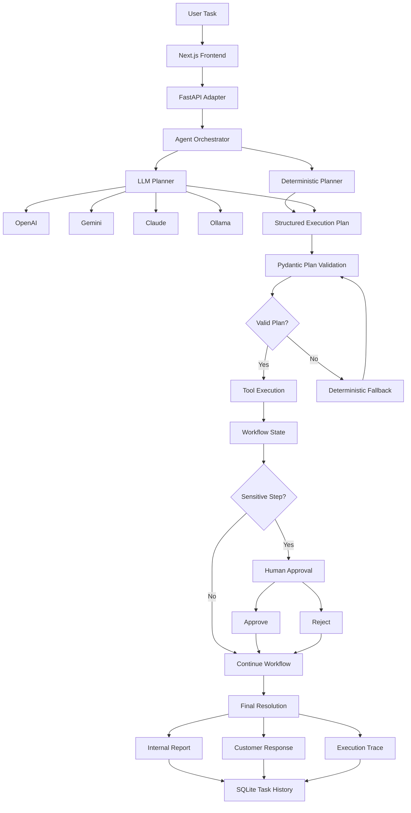

# AI Agent Orchestration System

A full-stack AI agent orchestration system for Customer Operations with tool calling, multi-step workflow execution, persistent task history, human-in-the-loop approval, and deterministic or LLM-based planning.


---

## Live Application

**Web Application:**  
https://ai-agent-orchestration-system.vercel.app

The hosted version is designed as a safe portfolio demonstration using fictional Customer Operations data.

---

## Overview

AI Agent Orchestration System demonstrates how an AI agent can be built as a controlled workflow system rather than a general-purpose chatbot.

The application receives a natural-language Customer Operations task and converts it into a structured execution workflow.

Depending on the request, the system can:

- Look up customer information
- Review customer cases
- Evaluate refund eligibility
- Calculate refund recommendations
- Determine priority
- Check SLA status
- Search previous task history
- Generate internal reports
- Draft customer responses
- Pause sensitive workflows for human approval
- Resume approved or rejected workflows safely

The system supports both deterministic planning and optional LLM-based planning.

LLMs can participate in planning, but backend components remain responsible for:

- Plan validation
- Tool authorization
- Argument validation
- Tool execution
- Workflow state
- Approval gates
- Persistent task history
- Safe failure handling

If an LLM cannot produce a valid plan for a supported workflow, the application can fall back to deterministic planning.

---

## Key Features

- Natural-language task interpretation
- Deterministic workflow planning
- Optional LLM-based planning
- LangGraph-based orchestration
- Multi-provider LLM support
- OpenAI integration
- Google Gemini integration
- Anthropic Claude integration
- Local Ollama integration
- Structured execution plans
- Pydantic plan validation
- Tool and argument validation
- Specialized tool routing
- Multi-step workflow execution
- Persistent workflow state
- Human-in-the-loop approval
- Approval and rejection resume behavior
- SQLite-backed task history
- Task-history search as an agent tool
- Execution traces
- Internal report generation
- Customer-response drafting
- Deterministic fallback when LLM planning fails
- Safe rejection of unsupported write actions
- Safe handling of unknown IDs
- Public Demo Mode
- Local Full Mode
- Fictional demonstration data
- FastAPI adapter for agent services
- Modern Next.js production frontend
- Legacy Streamlit interface retained for project history
- Automated backend and workflow testing

---

## System Architecture


```mermaid
flowchart TD
    A["User Task"] --> B["Next.js Frontend"]

    B --> C["FastAPI Adapter"]

    C --> D["Agent Orchestrator"]

    D --> E1["Deterministic Planner"]
    D --> E2["LLM Planner"]

    E2 --> P1["OpenAI"]
    E2 --> P2["Gemini"]
    E2 --> P3["Claude"]
    E2 --> P4["Ollama"]

    E1 --> F["Structured Execution Plan"]
    E2 --> F

    F --> G["Pydantic Plan Validation"]

    G --> H{"Valid Plan?"}

    H -->|Yes| I["Tool Execution"]
    H -->|No| J["Deterministic Fallback"]

    J --> G

    I --> K["Workflow State"]

    K --> L{"Sensitive Step?"}

    L -->|No| M["Continue Workflow"]
    L -->|Yes| N["Human Approval"]

    N --> O1["Approve"]
    N --> O2["Reject"]

    O1 --> M
    O2 --> M

    M --> P["Final Resolution"]

    P --> Q1["Internal Report"]
    P --> Q2["Customer Response"]
    P --> Q3["Execution Trace"]

    Q1 --> R["SQLite Task History"]
    Q2 --> R
    Q3 --> R
```

---

## Agent Workflow

A typical workflow follows this sequence:

```text
User Task
    ↓
Planner Selection
    ↓
Deterministic Planner or LLM Planner
    ↓
Structured Execution Plan
    ↓
Plan Validation
    ↓
Tool Selection
    ↓
Workflow Execution
    ↓
Human Approval when required
    ↓
Final Resolution
    ↓
Report / Customer Response
    ↓
Persistent Task History
```

Example:

```text
Review CASE-220, check eligibility,
calculate the refund,
and prepare a customer response.
```

The system can turn this into a structured workflow rather than sending the entire request directly to a language model.

---

## Planner Architecture

The application supports two planning approaches.

### Deterministic Planner

The deterministic planner recognizes supported Customer Operations requests and builds predefined, validated workflows.

Advantages:

- No API key required
- Predictable behavior
- Reproducible results
- Safe hosted demonstrations
- Reliable fallback behavior

It powers the public Demo Mode and can also be used locally.

---

### LLM Planner

The LLM planner allows supported language models to interpret more flexible natural-language requests.

Supported providers include:

- OpenAI
- Google Gemini
- Anthropic Claude
- Ollama

LLM-generated plans are not executed directly.

Before execution, the backend validates:

- Plan structure
- Tool names
- Tool availability
- Tool arguments
- Workflow compatibility

This keeps the language model responsible for planning while deterministic application code remains responsible for control and execution.

---

## Planner Fallback

LLM output can occasionally be malformed, incomplete, or incompatible with the available tool schema.

The system therefore implements deterministic fallback.

```text
User Request
     |
     v
LLM Planner
     |
     v
Valid Plan?
   /     \
 Yes      No
  |        |
  v        v
Execute   Deterministic Planner
               |
               v
           Valid Plan?
            /     \
          Yes      No
           |        |
           v        v
        Execute   Safe Failure
```

When fallback occurs, planner behavior remains visible rather than being silently hidden.

---

## Agent Tools

The agent uses specialized backend tools rather than allowing the language model to perform operations directly.

### Customer Lookup

Retrieves fictional customer information using a customer ID.

---

### Case Lookup

Retrieves information about a specific customer case.

---

### Policy Checker

Evaluates a case against configured refund-policy logic and determines whether it is:

- Eligible
- Not eligible
- Requires manual review

---

### Refund Calculator

Calculates a refund recommendation using available case and policy information.

It does not transfer real money.

---

### Priority Classifier

Determines the operational priority of a case.

---

### SLA Checker

Evaluates the case against its service-level target and identifies whether the SLA has been breached.

---

### Task History Search

Searches previous agent execution records.

Example:

```text
Show the most recent approved refund case.
```

---

### Internal Report Generator

Creates an internal report from the resolved workflow state.

---

### Customer Response Generator

Produces a customer-facing response draft from the available workflow information.

It does not send messages externally.

---

## Human-in-the-Loop Approval

Sensitive workflows can pause before completion.

For example:

```text
Customer Lookup
      ↓
Case Lookup
      ↓
Policy Checker
      ↓
Refund Calculator
      ↓
Approval Required
      ↓
Human Reviewer
   ┌───────┴───────┐
   ↓               ↓
Approve           Reject
   ↓               ↓
Resume Workflow
```

The reviewer can also provide a note that becomes part of the workflow record.

### Approved Workflow

When approved, the system can:

- Record the approval
- Continue the workflow
- Generate an internal report
- Draft a customer response when requested
- Mark the task as completed

### Rejected Workflow

When rejected:

- The recommendation remains rejected
- No refund is represented as processed
- An internal record can still be generated
- Follow-up output respects the rejection state

The application demonstrates approval orchestration only.

It does not transfer real funds.

---

## Persistent Task Memory

The application uses SQLite to persist workflow records.

Task history can include:

- Task ID
- Original request
- Planner mode
- Workflow status
- Tool execution history
- Customer ID
- Case ID
- Approval state
- Final outcome
- Completion time

Task history is not only visible to the user.

The agent can also access previous workflow records using the Task History Search tool.

This demonstrates persistent application memory rather than relying only on the active browser session.

---

## Execution Trace

Each workflow exposes an execution trace.

A workflow may contain steps such as:

```text
Customer Lookup
Case Lookup
Policy Checker
Refund Calculator
Priority Classifier
SLA Checker
Generate Report
Generate Customer Response
Task History Search
```

Execution information can include:

- Tool name
- Tool status
- Tool inputs
- Tool outputs
- Workflow order

This makes agent behavior inspectable instead of showing only a final answer.

---

## Application Modes

The project separates the hosted portfolio demonstration from full local experimentation.

| Mode | External API Keys | Planning | Intended Use |
|---|---|---|---|
| Demo | Not required | Deterministic | Hosted portfolio demonstration |
| Local Full | Optional | Deterministic or LLM | Full local experimentation |

---

## Public Demo Mode

Demo Mode is designed for safe hosted use.

In this mode:

- No external model provider is required
- Visitors are not asked to provide API keys
- Planning is deterministic
- Fictional customer and case records are used
- Human approval workflows remain available
- Supported tool execution remains functional
- Unsupported actions are blocked
- Unknown IDs fail safely
- Execution traces remain available
- Task history remains available
- Internal reports can be generated
- Customer-response drafts can be generated when supported

The public demo is intentionally isolated from real business systems.

---

## Demo Data

The project contains fictional Customer Operations data for demonstration purposes.

Current documented demo data includes:

```text
8 customers
10 cases
```

### Customer IDs

```text
CUST-101
CUST-102
CUST-103
CUST-104
CUST-105
CUST-106
CUST-107
CUST-108
```

### Case IDs

```text
CASE-220
CASE-221
CASE-222
CASE-223
CASE-224
CASE-225
CASE-226
CASE-227
CASE-228
CASE-229
```

Demo cases cover scenarios such as:

- Eligible refunds
- Non-eligible refunds
- Manual-review cases
- SLA breaches
- Multiple customer cases
- Task-history retrieval
- Human approval

No real customer or business information is included.

---

## Local Full Mode

Local Full Mode enables both deterministic and optional LLM planning.

Supported providers:

- OpenAI
- Google Gemini
- Anthropic Claude
- Ollama

Cloud-provider integrations require user-supplied API keys.

Ollama runs locally and does not require an external API key.

The same backend validation, tool execution, workflow state, approval, and task-history architecture remains in place regardless of planner provider.

---

## Supported Tasks

Examples include:

```text
Review CASE-220.

Check refund eligibility for CASE-220.

Calculate a refund for CASE-220.

Determine the priority and SLA status of CASE-225.

Check customer CUST-104 and summarize all open cases.

Show the most recent approved refund case.

Review CASE-220 and generate an internal report.

Review CASE-220 and prepare a customer response.
```

The agent can also combine multiple supported actions into one workflow.

Example:

```text
Review CASE-220, check eligibility,
calculate the refund,
and prepare a customer response.
```

---

## Safe Failure and Guardrails

The system intentionally rejects unsupported or unsafe operations.

Unsupported examples include:

```text
Sending emails
Sending SMS messages
Executing real refunds
Executing payments
Deleting customer records
Deleting case records
Closing cases
Reassigning cases
Modifying customer records
Arbitrary external-system writes
```

Example:

```text
Delete customer CUST-101.
```

The application rejects the request instead of converting it into another operation.

### Unknown Records

Example:

```text
Review CASE-999.
```

The agent reports that the case was not found.

Example:

```text
Check customer CUST-999.
```

The agent reports that the customer was not found.

### Missing Required Context

Example:

```text
Calculate a refund for CUST-101.
```

The system can explain that a case ID is required.

This behavior keeps the agent scope explicit and predictable.

---

## Supported Providers

### Deterministic

No API key or external model is required.

---

### OpenAI

Available for LLM planning in Local Full Mode with a user-supplied API key.

---

### Google Gemini

Available for LLM planning in Local Full Mode with a user-supplied API key.

---

### Anthropic Claude

Available for LLM planning in Local Full Mode with a user-supplied API key.

---

### Ollama

Available for fully local LLM planning.

Default documented endpoint:

```text
http://localhost:11434
```

Model availability depends on the models installed locally.

---

## Tech Stack

| Category | Technology |
|---|---|
| Production frontend | Next.js |
| Frontend language | TypeScript |
| Agent API adapter | FastAPI |
| Agent backend | Python |
| Agent orchestration | LangGraph |
| Plan validation | Pydantic |
| Persistent memory | SQLite |
| Deterministic planning | Custom planner |
| LLM planning | Multi-provider planner |
| OpenAI integration | OpenAI SDK |
| Gemini integration | Google GenAI SDK |
| Claude integration | Anthropic SDK |
| Local LLM integration | Ollama HTTP API |
| Testing | Pytest |
| Hosted frontend | Vercel |
| Legacy interface | Streamlit |
| License | MIT |

---

## Project Structure

```text
AI-Agent-Orchestration-System/
│
├── frontend/
│   ├── .openai/
│   ├── app/
│   ├── components/
│   ├── lib/
│   ├── public/
│   ├── .env.example
│   ├── components.json
│   ├── next.config.ts
│   ├── package-lock.json
│   ├── package.json
│   ├── tsconfig.json
│   └── vite.config.ts
│
├── src/
│   ├── agent/
│   │   ├── graph.py
│   │   ├── orchestrator.py
│   │   ├── plan_validator.py
│   │   ├── schemas.py
│   │   └── state.py
│   │
│   ├── execution/
│   │   ├── approval_manager.py
│   │   ├── executor.py
│   │   └── result_resolver.py
│   │
│   ├── memory/
│   │   ├── database.py
│   │   ├── repositories.py
│   │   └── seed.py
│   │
│   ├── planners/
│   │   ├── base.py
│   │   ├── deterministic.py
│   │   └── llm_planner.py
│   │
│   ├── providers/
│   │   ├── anthropic_provider.py
│   │   ├── base.py
│   │   ├── factory.py
│   │   ├── gemini_provider.py
│   │   ├── offline.py
│   │   ├── ollama_provider.py
│   │   └── openai_provider.py
│   │
│   ├── reporting/
│   │   ├── report_builder.py
│   │   └── response_builder.py
│   │
│   └── tools/
│       ├── base.py
│       ├── case_lookup.py
│       ├── customer_lookup.py
│       ├── generate_customer_response.py
│       ├── generate_report.py
│       ├── policy_checker.py
│       ├── priority_classifier.py
│       ├── refund_calculator.py
│       ├── registry.py
│       ├── sla_checker.py
│       └── task_history_search.py
│
├── tests/
│
├── generated_reports/
│
├── prototype/
│   └── conductors-score/
│
├── .streamlit/
│
├── app.py
├── .env.example
├── .gitignore
├── LICENSE
├── pyproject.toml
├── requirements.txt
├── uv.lock
└── README.md
```

The root `app.py` and `.streamlit/` directory are retained from the original Streamlit implementation.

The modern production interface lives under:

```text
frontend/
```

---

## Installation

### Clone the Repository

```bash
git clone https://github.com/Azoqoz/AI-Agent-Orchestration-System.git
cd AI-Agent-Orchestration-System
```

---

### Python Environment

#### Windows

```powershell
py -m venv .venv
.venv\Scripts\activate
py -m pip install -r requirements.txt
```

#### macOS / Linux

```bash
python3 -m venv .venv
source .venv/bin/activate
python3 -m pip install -r requirements.txt
```

---

### Frontend Dependencies

```bash
cd frontend
npm install
```

Use the scripts defined in `frontend/package.json` for local frontend development and production builds.

---

## Environment Configuration

Copy:

```text
.env.example
```

to:

```text
.env
```

Example backend configuration:

```env
APP_MODE=local

OPENAI_API_KEY=
ANTHROPIC_API_KEY=
GEMINI_API_KEY=

OLLAMA_URL=http://localhost:11434/api/generate
```

### Main Settings

| Variable | Purpose |
|---|---|
| `APP_MODE` | Selects hosted Demo Mode or Local Full Mode |
| `OPENAI_API_KEY` | Optional OpenAI API key |
| `ANTHROPIC_API_KEY` | Optional Anthropic API key |
| `GEMINI_API_KEY` | Optional Gemini API key |
| `OLLAMA_URL` | Local Ollama generation endpoint |

Cloud-provider API keys are not required for deterministic planning.

---

## Running the Legacy Streamlit Interface

The original Streamlit interface remains available for local experimentation.

### Demo Mode

#### Windows

```powershell
$env:APP_MODE = "demo"
py -m streamlit run app.py
```

#### macOS / Linux

```bash
export APP_MODE=demo
python3 -m streamlit run app.py
```

---

### Local Full Mode

#### Windows

```powershell
$env:APP_MODE = "local"
py -m streamlit run app.py
```

#### macOS / Linux

```bash
export APP_MODE=local
python3 -m streamlit run app.py
```

The legacy interface typically runs at:

```text
http://localhost:8501
```

---

## Running with Ollama

Ollama enables fully local LLM planning.

### 1. Install Ollama

Install Ollama on the local machine.

### 2. Pull a Model

Example:

```bash
ollama pull llama3.2
```

### 3. Run the Model

```bash
ollama run llama3.2
```

### 4. Start the Agent in Local Mode

Set:

```text
APP_MODE=local
```

Then choose:

```text
Planning Mode: LLM
Provider: Ollama
```

No external API key is required.

---

## Testing

Run the automated Python test suite:

```bash
python -m pytest
```

The suite covers areas including:

- Application modes
- Deterministic planning
- LLM-planner behavior
- Ollama planning
- Execution-plan validation
- Planner fallback
- Tool behavior
- Workflow execution
- Human approval
- Approval resume behavior
- Rejection behavior
- Persistent task history
- Task-history search
- Unsupported actions
- Unknown customer IDs
- Unknown case IDs
- Safe failures
- Result resolution

The exact test count should be taken from the latest local test run because the project continues to evolve.

---

## Deployment

### Production Frontend

The current portfolio interface is deployed on Vercel:

```text
https://ai-agent-orchestration-system.vercel.app
```

The production UI is maintained in:

```text
frontend/
```

The repository also includes a FastAPI adapter that exposes the agent services to the newer frontend architecture.

---

## Legacy Interface

The project originally used Streamlit as its primary user interface.

The legacy implementation remains in the repository:

```text
app.py
.streamlit/
```

It is retained for:

- Development history
- Local experimentation
- Comparison with the modern frontend
- Direct access to the original application workflow

The current portfolio-facing interface uses the newer frontend architecture instead.

---

## Current Limitations

- Demo Mode uses fictional Customer Operations data
- The system is not connected to a production CRM
- The system does not execute real refunds or payments
- The system does not send real emails or SMS messages
- Customer and case records are not modified
- LLM-generated plans can be invalid or incomplete
- Deterministic fallback supports recognized workflows only
- Provider behavior depends on the selected model
- Ollama requires a locally running Ollama server
- Local model quality depends on the installed model
- Human approval is implemented inside the application
- SQLite persistence is designed for the current project scope
- Production authentication is not currently included
- Enterprise authorization is not currently included
- Distributed tracing is not currently included
- The project does not connect to real external business systems

---

## Future Improvements

- Add production authentication
- Add role-based authorization
- Connect to a real CRM or ticketing system
- Add additional operational tools
- Add richer structured tool calling
- Add planner evaluation benchmarks
- Add workflow retry policies
- Add tool-level timeout handling
- Add workflow versioning
- Add distributed tracing
- Add production audit logging
- Add PostgreSQL-backed persistence
- Add Redis-backed workflow state
- Add asynchronous job execution
- Add external human-approval integrations
- Add Docker support
- Add continuous integration
- Add automated deployment workflows
- Add production secret management
- Add rate limiting
- Add production monitoring and observability

---

## Why This Project Matters

An AI agent requires more than sending a prompt to a language model.

A practical agent system needs explicit orchestration around the model.

This project demonstrates AI Engineering concepts including:

- AI agent architecture
- Tool calling
- Multi-step workflow orchestration
- LangGraph orchestration
- Deterministic planning
- LLM-based planning
- Multi-provider LLM integration
- Structured execution plans
- Plan validation
- Planner fallback
- Tool routing
- Workflow-state management
- Human-in-the-loop approval
- Persistent task memory
- Task-history retrieval
- Safe failure handling
- Unsupported-action protection
- Local LLM integration with Ollama
- Offline operation without API keys
- Report generation
- Customer-response generation
- Execution tracing
- FastAPI service integration
- Modern frontend integration
- Automated testing
- Modular software architecture

The project demonstrates how LLMs can participate in planning while deterministic backend components remain responsible for validation, tool execution, approval gates, workflow control, and persistent state.

---

## License

This project is licensed under the MIT License.

---

## Author

Developed by [Azoqoz](https://github.com/Azoqoz).
